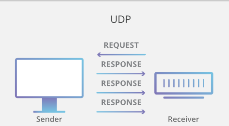
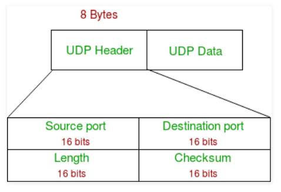

# User Datagram Protocol
## Wat is UDP?
UDP of User Datagram Protocol is een van de basisprotocollen van het internet. Een basisprotocol is een netwerkprotocol waarmee computers onderling op een computernetwerk kunnen communiceren met elkaar. Een netwerkprotocol is dan weer een afgesproken communicatiewijze voor netwerkcomponenten.

Een opvallend kenmerk van UDP is de robuustheid van de aflevering van gegevens via het internet. Dit is ook de reden waarom bij UDP vooral real-time data gebruikt wordt. Een UDP bevindt zich in een IP-stack, een IP-stack is een internetprotocol. Daar communiceren ze met ander lagen van het OSI-model (Open Systems Interconnection).

Een computer kan verschillende andere sessies hebben met andere computers, en zelfs meerdere sessies met één andere computer. Elke sessie wordt gekenmerkt met een ‘protocol identifier’, een TCP of een UDP. Via multiplexing wordt dit allemaal via dezelfde netwerkaansluiting gestuurd. Multiplexing is meerdere signalen en datastromen combineren tot één signaal.
UDP ondersteunt proces-naar-proces en TCP ondersteunt host-naar-host. TCP verzendt vooral individuele pakketten terwijl UDP datagrammen bijvoorbeeld berichten verzendt. Deze datagrammen worden als de optimale manier beschouwd om te communiceren. UDP is ook verbinding loos in vergelijking met TCP en dit is komt doordat er geen virtueel circuit nodig is voor de gegevensoverdracht. UDP biedt twee services die niet worden geleverd door de IP-laag.

Een UDP opereert op hetzelfde niveau van een TCP en wordt beschreven in RFC 768. Een TCP of Transmission Control Protocol is een verbinding georiënteerd protocol dat vaak voorkomt bij gegevensoverdracht over netwerkverbindingen op het internet, maar ook op computernetwerken bijvoorbeeld een thuisnetwerk. RFC staat voor Request for Comments, dit zijn documenten die de protocollen en andere onderdelen van het internet beschrijven.

UDP heeft zijn eigen functies en poorten, net zoals een computer dit ook heeft. De meest gebruikte zijn Domeinnaamsysteem, Dynamic Host Configuration Protocol, Trivial File Transfer Protocol, Eenvoudig netwerkbeheerprotocol en Netwerktijdprotocol. Het DNS-protocol (Domeinnaamsysteem) is een van de bekendste en meest gebruikte. Het doel is om domeinnamen te vertalen naar IP-adressen, het wordt vooral op grote schaal gebruikt. Het DHCP (Dynamic Host Configuration Protocol) wordt gebruikt op netwerken die geen gebruik maken van statische IP-adrestoewijzing. Een client kan een IP-adres opvragen bij de DHCP-server, daarna wordt dit IP-adres toegekend aan het apparaat. Dit is een soort huurovereenkomst, als er geen verlenging wordt gevraagd loop deze dus af. Het TFTP (Trivial File Transfer Protocol) biedt een methode van overdracht zonder instelling. Er is op geen enkele manier zeker dat de bestandsoverdracht goed gaat verlopen. Het wordt gebruikt voor het upgraden van firmware en software voor apparaten. Het SNMP (Eenvoudig netwerkbeheerprotocol) is een methode voor netwerkbeheer. De mogelijkheden van SNMP is kunnen monitoren, configureren en besturen van netwerkapparaten. Het NTP (Netwerktijdprotocol) is het synchroniseren van apparaten op het internet. Het NTP wordt ook gezien als een van de meest over het hoofd geziene protocollen. De meeste moderne besturingssystemen maken gebruik van NTP. Het kan heel gemakkelijk het ene apparaat aan het andere koppelen, hierdoor is NTP een essentieel onderdeel van de netwerksystemen.

## Hoe werkt UDP?
UDP gebruikt dus een internetprotocol om een datagram van de ene computer naar de andere te versturen. De gegevens in een UDP-pakket wordt ingepakt en die krijgt zijn eigen header. Als het UDP-pakket ingepakt is in een IP-pakket wordt het naar zijn bestemming verstuurd. UDP vertrouwt op de apparaten waartussen de gegevens verstuurt worden. De meeste toepassingen van UDP wachten op een antwoord die wordt verwacht na het versturen van de pakketten via UDP. Als er binnen een bepaalde tijd geen antwoord komt dan verzendt de applicatie het pakket opnieuw of stopt het met proberen.

## UDP headers
UDP gebruikt headers als een onderdeel van de verpakking van gegevens voor de overdracht. Deze headers bevatten een set parameters die gedefinieerd zijn door de technische specificaties van het protocol. De header heeft vier velden met elk 2 bytes. Deze vier velden zijn een bronpoortnummer, een bestemmingspoortnummer, een lengte en een checksum. De bronpoortnummer is het nummer van de afzender, de bestemmingspoortnummer is het nummer waar het datagram naartoe gestuurd wordt, de lengte is de lengte van de gegevens in bytes en de checksum wordt gebruikt bij foutcontrole.

## Poorten
Voor een communicatie van host naar host gebruiken veel toepassingen de datagram sockets. Een applicatie biedt een socket aan het einde van een overdracht, een combinatie van een IP-adres en een poort. Op deze manier doet UDP aan applicatiemultiplexing. Een poort is eigenlijk een softwarestructuur die wordt geïdentificeerd door het poortnummer, dit nummer is een 16-bits geheel getal. Poort 0 is niet mogelijk want deze is gereserveerd, het is wel een toegestane bronpoortwaarde als er geen reactie komt op het verzendproces.

## Verschil tussen TCP en UDP
Een TCP is in vergelijking met een UDP wel betrouwbaar. Bepaalde protocollen die via UDP werken, implementeren zichzelf met een verificatiemethode. Op die manier zorgen ze voor een vervanging van de functionaliteit die TCP heeft op dat gebied. Nog een verschil tussen TCP en UDP is dat UDP zonder error controles TCP uitvoert.
TCP is een verbindingsgericht protocol terwijl UDP een verbinding loos protocol is. TCP is een meer voorkomend protocol dan UDP, UDP wordt meer gebruikt voor streaming, gaming en live gebeurtenissen. UDP staat ervoor bekend dat er sneller gegevens verloren kunnen gaan waardoor het sneller is en heeft ook minder middelen nodig. TCP heeft de zekerheid dat gegevens niet verloren gaat en dat alle ze zeker op bestemming zullen aankomen. Bij UDP maakt het niet uit in welke volgorde de pakketten toekomen maar bij TCP moet dit gebeuren in de volgorde waarin ze verstuurd zijn. Bij UDP is het dus mogelijk dat er gegevens verloren gaan maar de zender weet ook niet of het pakket is toegekomen. TCP heeft een grotere header dan een UDP, deze is het best voor applicaties met een hoge betrouwbaarheid en als de overdracht tijd minder belangrijk is. UDP is dan beter geschikt voor applicaties waarbij het snel en efficiënt moet gaan.

## Verschil tussen UDP en UDP-Lite
UDP-Lite (Lightweight User Datagram Protocol) is net zoals UDP een verbinding loos protocol maar UDP-Lite verschilt met UDP omdat UDP-Lite het mogelijk maakt om de mogelijk beschadigde datalading naar een applicatie te leveren in plaats van deze gewoon weg te gooien. Hierdoor kunnen beslissingen gemaakt worden over de oprechtheid van de gegevens in de toepassingslaag. UDP-Lite wordt in RFC 3828 geschreven en niet in RFC 768 zoals UDP. Nog een verschil is dat UDP checksum gebruikt om de pakketten te beschermen maar UDP-Lite gebruikt enkel gedeeltelijke checksums waardoor slechts een deel van het datagram beschermd wordt. Zo zullen er zeker pakketten geleverd worden die gedeeltelijk beschadigd zijn. UDP-Lite is meer ontworpen voor multimediaprotocollen.

## Welke services vertrouwen op UDP?
UDP wordt vaak gebruikt in tijdgevoelige communicatie waarbij het soms beter is om gegevens of pakketten te laten vallen dan te wachten. Spraak en video worden daarom via UDP verzonden omdat ze tijdsgevoelig zijn en ze zijn ook ontworpen om eventueel verlies aan te kunnen. DNS- en NTP-servers werken beide via UDP want deze moeten snel en efficiënt zijn.

## Functies van UDP
UDP heeft kenmerken die het voordeliger maken voor het gebruik met applicaties die verloren gegevens kunnen tolereren. Bij realtime toepassingen kunnen de pakketten worden verwijderd en ontvangen in een andere volgorde dan dat ze verzonden zijn. UDP kan ook gebruikt worden bij transacties gebaseerde protocollen zoals DNS. Het kan ook gebruikt worden bij een groot aantal clients zoals gaming.

## Betrouwbaarheid en oplossingen voor congestie controle
Door gebrek aan betrouwbaarheid moeten de applicaties bereid zijn om eventueel pakketverlies te accepteren. Als er UDP gebruikt wordt is het van toepassing dat de eindgebruiker bevestiging geeft over het ontvangen van het bericht. Als er een hoge betrouwbaarheid nodig is kan je beter TCP gaan gebruiken. De meeste toepassingen van UDP gebruikt geen betrouwbaarheidsmechanismen want deze kunnen voor hindernissen zorgen. Bijvoorbeeld bij media streaming is het geen groot probleem als er verlies is.

## Voordelen en nadelen van UDP
UDP heeft zijn voor- en nadelen. Als voordeel is er de hogere overdrachtssnelheid, een nadeel is dat het onbetrouwbaar en onzeker is. Je bent niet zeker of de gegevens overgemaakt gaan worden. Dit is doordat bij een dataoverdracht de zender niet moet wachten op een ontvangstbevestiging. Er wordt dus gebruikt gemaakt van een eenvoudig transmissiemodel. 

## Toepassingen van UDP
UDP wordt vaak gebruikt bij toepassingen waarbij het snel overdragen van gegevens en een korte reactietijd belangrijk is. Ook toepassingen waarbij het minder erg is als er gegevens verloren gaan.

UDP is een lichtgewicht onder de protocollen. Het wordt een lichtgewicht genoemd omdat er geen zware belasting is van details. Enkele belangrijke toepassingen zijn beschikbaarheid van servers en streamingtoepassingen. Bij een live videostream moet de gebruiker vertrouwen op de server. De meeste live videostreams gebruiken UDP in plaats van TCP. Als tijdens de uitzending de verbinding even verloren of verbroken gaat, is dit eigenlijk een vorm van pakketverlies. Door dit pakketverlies is het wel mogelijk om de hele video af te spelen. Online games worden op exact dezelfde manier uitgevoerd. Als er tijdens het gamen kleine glitches voorkomen is dit omdat er een paar UDP-pakketten missen.

In sommige gevallen worden de foutcorrectietechnieken gebruikt om audio- en videokwaliteit te verbeteren. UDP kan ook gebruikt worden voor toepassingen die afhankelijk zijn van hun betrouwbare informatiewisseling, zij hebben wel hun eigen methoden om pakketten te beantwoorden. Deze services zijn voordelig doordat ze niet verbonden zitten aan vaste patronen om te garanderen dat de pakketten juist verzonden zijn. De gebruikers kunnen zelf beslissen hoe ze erop reageren en wanneer. Het is bijvoorbeeld handig om UDP te gebruiken waarbij er een snelle overdracht moet gebeuren maar waarbij het niet erg is om enkele gegevens te verliezen.

# Bronnen
- [Wikipedia User Datagram Protocol](https://nl.wikipedia.org/wiki/User_Datagram_Protocol)
- [Wikipedia Transmission Control Protocol](https://nl.wikipedia.org/wiki/Transmission_Control_Protocol)
- [Wikipedia Netwerkprotocol](https://nl.wikipedia.org/wiki/Netwerkprotocol)
- [Wikipedia Internetprotocol](https://nl.wikipedia.org/wiki/Internetprotocol)
- [Wikipedia Request for Comments](https://nl.wikipedia.org/wiki/Request_for_Comments)
- [Wikipedia Domain Name System](https://nl.wikipedia.org/wiki/Domain_Name_System)
- [Wikipedia Network Time Protocol](https://nl.wikipedia.org/wiki/Network_Time_Protocol)
- [Forumstandaardisatie UDP](https://www.forumstandaardisatie.nl/standaard/udp)
- [Wikipedia TCP- en UDP-poorten](https://nl.wikipedia.org/wiki/TCP-_en_UDP-poorten)
- [Wikipedia Multiplexing](https://nl.wikipedia.org/wiki/Multiplexing)
- [Speedcheck UDP](https://www.speedcheck.org/nl/wiki/udp/)
- [Transip Wat is TCP UDP](https://www.transip.be/knowledgebase/artikel/2086-wat-is-tcp-udp/)
- [Nldit Internet-networking](http://www.nldit.com/netwerken/internet-networking/201309/69722.html)
- [Searchnetworking UDP](https://searchnetworking.techtarget.com/definition/UDP-User-Datagram-Protocol)
- [Cloudflare UDP](https://www.cloudflare.com/learning/ddos/glossary/user-datagram-protocol-udp/)
- [Geeksforgeeks UDP](https://www.geeksforgeeks.org/user-datagram-protocol-udp/)